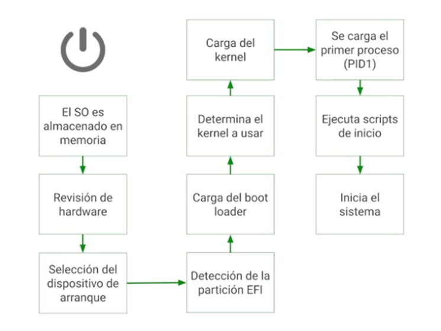
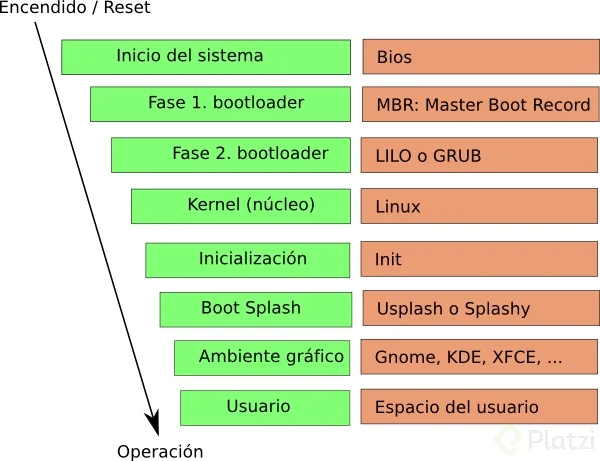

# Arranque del sistema

## 1 - Arranque del sistema operativo: Conceptos y procesos clave

Cunado presionamos el boton de encendido de nuestro servidor o virtualizamos un sistema a traves de herramientas como VirtualBox, inicia una compleja serie de pasos que aseguran que nuestro sistema funcione correctamente. Tal como se muestra en los siguientes diagramas, describiremos cada uno de estos procesos de forma detallada.

### ¿Qué ocurre en las primeras etapas del arranque?

**1. Carga del sistema operativo:** Todo comienza con el sistema operativo cargándose en memoria RAM para poder ejecutarse.

**2. Revisión del hardware:** A través de este proceso se busca monitorizar todos los dispositivos conectados a través del Firmware. El BIOS del servidor se encarga de verificar que todos los componentes de hardware estén funcionando correctamente, asegurando que la memoria, discos y el procesador no tengan fallos.

**3. Selección del dispositivo de arranque:** En ella se muestra un grub donde seleccionaremos que sistema operativo a utilizar.

**4. Detección de la partición EFI:** Luego de detectar la partición EFI correspondiente al sistema operativo que queremos cargar , como Windows, Ubuntu o Red Hat. Se verificará el espacio de almacenamiento del sistema elegido. 

**5.Carga del boot loader:** Este proceso arrancara el sistema elegido anteriormente.

**6. Determina el kernel a usar:** A través de este paso el sistema elige el kernel mediante el cual el sistema funcionara, este proceso lo hace el sistema tomando en cuenta lo que ya se tiene instalado.

**7. Carga del kernel:** Paso donde se irá iniciando el sistema para mostrar al usuario.

**8. Se carga el proceso (PID1):** Este proceso es que se comenzara a iniciar el proceso de INIT en Linux.

**9. Ejecuta scripts de inicio:** Para este proceso se cargarán todos los scripts que se irán ejecutando en segundo plano conocidos como daemons o demonios.

**10. Inicio del sistema:** El sistema se habrá iniciado correctamente para poder ser usado por el usuario administrador o usuario normal.

### ¿Qué papel juega el proceso de init?

Tras determinar el kernel, se lanza el primer proceso del sistema operativo, conocido cono **PID 1**, que es el proceso **init**. Este se encarga de controlar el sistema junto a sus demonios, luego se ejecutan los scripts de inicio: configuran las conexiónes a repositorios, inician demonios y aseguran que todas las aplicaciones del sistema funcionen adecuadamente.

### Firmware del sistema

Hace un inventario y chequeo de todos los dispositivos conectados al sistema al momento del arranque (discos, memorias, etc.) y asegura que no haya corrupción en los mismos.
Este a su vez crea interfaces para que el software del sistema operativo pueda usar dispositivos.

### Boot Loader

El Boot Loader separa el firmware del sistema operativo, eligiendo el dispositivo de arranque adecuado. Por defecto la mayoria de distribuciones Linux usan **GRUB (Grand Unified Bootloader)**, un gestor que permite recuperar el sistema y arrancar Linux con parámetros extra.
Actualmente existen dos versiones de GRUB conocidas, GRUB Legacy y GRUB 2.

### Diferencias entre BIOS  y UEFI

* **BIOS:** Conocido como arranque Legacy, el BIOS utiliza un mecanismo llamado Master Boot Record para organizar sectores de disco para diferentres sistemas operativos.
* **UEFI:** Es la evolución del BIOS y utiliza un sistema de particiones EFI para manejar el arranque del sistema, este permite modificar tablas de particiones por sistemas mayores y aporta flexibilidad, lo que aveces genera problemas por ejemplo Windows actualiza y modifica UEFI afectando a GRUB.

### Lins útiles:

[https://www.intel.com/content/www/us/en/support/articles/000033003/server-products.html](https://www.intel.com/content/www/us/en/support/articles/000033003/server-products.html)

[https://www.intel.com/content/www/us/en/support/articles/000033003/server-products.html](https://www.intel.com/content/www/us/en/support/articles/000033003/server-products.html)

## 2 - Modo Recovery

### ¿Qué es el modo Recovery en Ubuntu?

Te permite acceder y recuperar funcionalidades administrativas vitales en caso de problemas con el sistema operativo, se pueden realizar tareas como actualizar paquetes, acceder como usuario root para funciones administrativas y limpiar espacio en disco.

### Configurar una maquina virtual para practicar

Para relizar ejecicios relacionados con el modo recovery es recomendable utilizar una qmaquina virtual corriendo sobre VirtualBox con el sistema operativo Ubuntu. Configuracion sugerida:

* RAM: 4 GB (aunque 2 GB pueden ser suficientes).
* Procesador: 1 núcleo.
* Almacenamiento: Disco de 25 GB.
* Adaptador de red: Configurado como tipo puente (bridge en inglés).

### Iniciar en el grupo de arranque

Si usas VirtualBox que utiliza BIOS en lugar de UEFI, accedes manteniendo presionada la tecla **shift** al arrancar el sistema. Si estas usando una maquina con **UEFI**, presionas ESC. Una vez adentro seleccionas **Advanced Options for Ubuntu** para acceder a diferentes versiones del kernel y funciones de reparacion.

Desde aquí podrás ver diversas opciones para:

**Resume:** Salir del modo Recovery y continuar con el arranque normal.
**Clean:** Limpieza de espacio en disco.
**The Package:** Reparación e instalación de paquetes rotos.
**FsCheck:** Revisión y reparacion del sistema de archivos.
**Group:** Actualización del cargador de GRUB.
**Network:** Habilitación del networking, útil en escenarios de recuperación post-compromiso.
**Root:** Acceder como superusuario root para tareas administrativas avanzadas, como modificar archivos critiocos del sistema.

