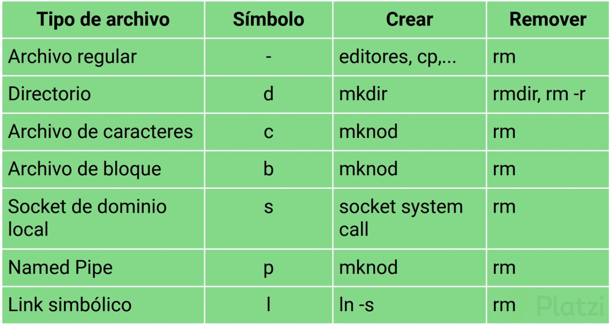
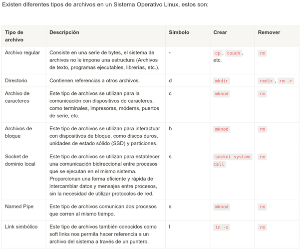

# Sistemas de archivos y particionamiento

## 1 - Fundamentos de sistemas de archivos en Linux y Windows

### ¿Qué son los sistemas de archivos?

Un sistema de archivos es una metodología que permite almacenar, mover, eliminar y buscar archivos de manera eficiente en un dispositivo de almacenamiento. Este sistema dicta como nuestros discos duros manejan información a nivel de bits y bytes, permitiendo diversas interacciones como almacenamiento y transferencia de archivos. La compatibilidad puede varias dependiendo de la forma en que se organizan y administran los datos en el disco duro.

### ¿Cuáles son los sistemas de archivos más comunes?

#### Sistemas FAT  y FAT32

* FAT: Fue creado para discos mas pequeños y ofrece compatibilidad básica.
* FAT32: Permite manejar archivos y particiones de mayor tamaño comparado con FAT, ofreciendo compatibilidad entre Linux y Windows.

#### Sistemas NTFS de Windows

Es un sistema de archivos robusto originado en servidores Windows, actualmente se ha integrado soporte para NTFS en Linux, lo que permite manejar archivos de hasta 16 terabytes y crear particiones de hasta 256 terabytes.

#### EXT4 el estándar de Linux

Este sistema permite almacenar archivos grandes y es particularmente eficiente para manejar grandes volúmenes de datos en servidores dedicados a Linux. Pero no es compatible con Windows.

#### XFS alto rendimiento

A partir de RHEL8 se ha convertido en un estándar popular debido a su robustez y capacidad para manejar datos de manera eficiente. Es especialmente útil en entornos donde se requiere un intercambio rápido de información, como en servidores de bases de datos.

#### BtrFS sistema de archivos moderno

Conocido como B-Tree File System es una alternativa moderna XFS que ofrece además la creación de particiones en servidores Linux. Opción versátil para quienes buscan un sistema sólido y flexible para administrar datos grandes.

#### ZFS el ejemplar en servidores

Surgió como un sistema de archivos privado en los servidores alrededor de 2010 y fue abierto en 2016. Este sistema es ideal para servidores como SUSE y ofrece características de integridad de datos.

#### Elección del sistema de archivos adecuado

* Compatibilidad con sistemas operativos.
* Capacidad de almacenamiento: espacio máximo de archivo y partición soporta.
* Rendimiento y robustez: Equilibrio adecuado entre velocidad y estabilidad, particularmente en servidores de bases de datos y alta demanda.

### Links útiles

**Red Hat:** [https://docs.redhat.com/en/documentation/red_hat_enterprise_linux/8/html-single/managing_file_systems/index](https://docs.redhat.com/en/documentation/red_hat_enterprise_linux/8/html-single/managing_file_systems/index)

**Ubuntu:** [https://linuxhint.com/best-file-system-ubuntu/](https://linuxhint.com/best-file-system-ubuntu/)

**Linux File System:** [https://linuxhint.com/best-file-system-ubuntu/](https://linuxhint.com/best-file-system-ubuntu/)


## 2 – Particionamiento y administración de almacenamiento en Servidores Linux

El particionamiento de disco no solo afecta como se almacena la información, sino también como se accede y gestiona. Se verán los comandos necesarios para poder identificar y gestionar la memoria de nuestro sistema de almacenamiento.

### Comando `df`

Es empleado para reportar el uso de espacio en disco en los sistemas de archivos.

**Comando básico `df`**

Muestra información sobre el espacio en disc disponible y utilizado por cada sistema de archivos.

**Comando avanzado `df -Th`**

* `-T` muestra el tipo de sistema de archivos
* `-h` convierte la información a un formato legible para humanos, con tamaños como MB, GB, etc.

### Comando `lsblk`

List Block Devices es un comando que lista todos los dispositivos de bloque, los cuales incluyen discos duros, memorias RAM, etc.

**Comando básico `lsblk`**

Muestra los dispositivos de disco disponibles y sus puntos de montaje.

**Comando con opciones `lsblk -f`**

* `-f` detalla el sistema de archivos asociado a cada dispositivo y proporciona más información útil para la administración de discos.

### Comando `fdisk`

Es un comando para manipular tablas de partición. 
Para listar particiones:
```
sudo fdisk -l
```
Donde la opción `-l` lista todas las particiones en el sistema.

### Diferencias clave entre particionamiento en Ubuntu y Red Hat

**Ubuntu:**

* Utiliza particiones estándar, donde el sistema root suele ocupar una gran parte del espacio disponible. Ejemplo: `lsblk -f`

**Red Hat:**

* Utiliza LVM (Logical Volume Manager) permitiendo una administración mas flexible del disco. Permitiendo una gestión avanzada de discos y particiones, facilidad para redimensionar volúmenes y un uso eficiente del espacio mediante agrupación lógica de discos.

### Memoria SWAP

Es una partición del disco duro que actúa como un espacio de respaldo cuando la memoria RAN del sistema se encuentra llena, asegurando que los procesos continuen ejecutándose incluso cuando se agota. Para verificar la memoria SWAP se utiliza el comando `free -h`.

### Links útiles

**Red Hat:** [https://docs.redhat.com/en/documentation/red_hat_enterprise_linux/6/html/installation_guide/s2-diskpartrecommend-x86](https://docs.redhat.com/en/documentation/red_hat_enterprise_linux/6/html/installation_guide/s2-diskpartrecommend-x86)

**GUID Partition Table:** [https://en.wikipedia.org/wiki/GUID_Partition_Table#Partition_type_GUIDs](https://en.wikipedia.org/wiki/GUID_Partition_Table#Partition_type_GUIDs)


## 3 – Creación y gestión de archivos de memoria swap en Linux

La memoria swap juega un rol crucial en la administración de recursos del sistema, especialmente cuando la memoria RAM se satura. A medida que la memoria se agota, el rendimiento del sistema comienza a degradarse corriendo el riesgo de reiniciarse, en ese caso entra en juego la memoria swap actuando como una extensión temporal de la RAM.

Linux la utiliza automáticamente como un recurso de emergencia invaluable, pero no ofrece el mismo rendimiento ya que opera en discos duros.

### Configurar un archivo swap en Linux

1.	Ubicación y creación del archivo
   
    *	Cambia al directorio raíz como usuario root

    * Crea un archivo swap usando el comando `fallocate`
    ```
    sudo fallocate -l 2G /swapfile
    ```

2.	Configuración de permisos

    *	Ajusta los permisos de acceso al archivo para mayor seguridad
    ```
    sudo chmod 600 /swapfile
    ```

3.	Convertir el archivo a swap

    *	Usa el comando `mkswap` para preparar el archivo:
    ```
    sudo mkswap /swapfile
    ```

4.	Activación del swap

    * Activa el archivo swap
    ```
    sudo swapon /swapfile
    ```

    *	Verifica su activación con
    ```
    free -h
    ```

5.	Configuración del persistencia

    * Edita el archivo `/etc/fstab` para asegurar que el swap se active al arrancar el sistema    
    ```
    sudo vim /etc/fstab
    ```

    * Añade la línea
    ```
    /swapfile none swap sw 0 0
    ```

### Ajustar o desactivar el archivo swap

* **Desactivar swap**
```
sudo swapoff /swapfile
```

* **Eliminar configuracion**

Edita y elimina la entrada correspondiente de `/etc/fstab` como usuario root.

* **Borrar el archivo**
```
sudo rm /swapfile
```

### Links útiles

[https://cdn.ttgtmedia.com/rms/onlineimages/whatis-virtual%20_vs_physical_memory-f.png](https://cdn.ttgtmedia.com/rms/onlineimages/whatis-virtual%20_vs_physical_memory-f.png)

[https://linuxopsys.com/topics/linux-fstab-options](https://linuxopsys.com/topics/linux-fstab-options)

[https://access.redhat.com/documentation/en-us/red_hat_enterprise_linux/6/html/installation_guide/s2-diskpartrecommend-x86](https://access.redhat.com/documentation/en-us/red_hat_enterprise_linux/6/html/installation_guide/s2-diskpartrecommend-x86)


## 4 – Arbol de directorios de Linux

### /bin

Almacena todos los archivos binaries ejecutables necesarios para el funcionamiento del sistema operativo. Aquí es donde el sistema busca los programas ejecutables como bash. Si queremos instalar un nuevo programa para que sea ejecutable a nivel de sistema, deberíamos colocarlo en esta carpeta.

```
cd /bin
ls -la
```

### /boot

Contiene importantes archivos de configuración necesarios para el arranque del sistema. Un archivo de especial interés es grub-config, el cual no debería ser editado directamente ya que contiene las directrices de arranque del sistema operativo.

```
cd /boot
ls -la
cat grub/grub-config
```

### /dev

Hace referencia a Devices (dispositivos) y contiene archivos que se refieren a los dispositivos conectados al sistema. Un archivo notable es dev/null muy útil para dirigir salidas no deseadas sin dejar rastro.

```
cd /dev
ls -la
echo “Hola Mundo” > /dev/null
```

### /etc

Contiene todos los archivos de configuración críticos del sistema, entre estos se encuentra sudoers que gestiona los permisos de superusuario y hostname que define el nombre del host del sistema.

```
cd /etc
ls -la
```

### /home

En home se almacenan los archivos personales de cada usuario del sistema. Al crear un usuario, se le asigna un directorio aquí, que puede contener subcarpetas para organizar documentos, música, descargas, etc.

```
cd /home
ls
```

### /lib y /lib64

Contiene librerías necesarios para que las aplicaciones ubicadas en bin o sbin puedan funcionar correctamente. Son esencialmente dependencias que las aplicaciones buscan y utilizan.

### /media y /mount

Son directorios designados para montar dispositivos de almacenamiento, mientras que media suele utilizarse para discos de uso a largo plazo, mount frecuentemente se reserva para dispositivos temporales como USB.

### /opt
Este directorio se reserva para aplicaciones opcionales de terceros, como programas que no vienen por defecto en el sistema, por ejemplo, herramientas de auditoria de seguridad.

### /proc
Contiene archivos en forma de referencias que muestran los procesos activos en el sistema.

### /var
Destinados a archivos e información que cambia constantemente, como logs, correos y archivos de spool, los logs de cada crash del sistema se guardan aquí.

### /run
Contiene información sobre procesos y demonios que se ejecutan al inicio del Sistema, es esencial para gestionar que servicios están activos tras cada arranque.

### /system
Resguarda archivos vitales del sistema operativo, como configuraciones de firmware y del kernel.

### Links útiles

[https://www.geeksforgeeks.org/linux-file-hierarchy-structure/](https://www.geeksforgeeks.org/linux-file-hierarchy-structure/)

[https://blog.desdelinux.net/que-es-devnull-y-como-puede-ayudarte/](https://blog.desdelinux.net/que-es-devnull-y-como-puede-ayudarte/)


## 5 – Tipos de archivos en Linux y su gestión en servidores

### Archivos regulares

Son la forma mas común de archivos en Linux, están compuestos por una serie de bytes que representan diferentes tipos de informacion. Los ejemplos mas comunes son archivos de texto plano (.txt o .log), ejecutables (.sh scripts de Shell o programas que el sistema pueda ejecutar directamente) o archivos de imágenes y música.

Estos archivos suelen estar representados por el símbolo `–` al ejecutar el comando `ls` en la terminal.

### Archivos de directorio

Los directorios en Linux son también archivos y funcionan de manera similar a un diccionario en programacion, guardando referencias a otros archivos en el sistema. Cada entrada en un directorio apunta a un archivo especifico, permitiendo su organización y acceso, los directorios funcionan como punteros.

Al ejecutar el comando `ls` los directorios se indican con una `d`.

### Archivos de enlaces o links

Son conexiones o referencias a otros archivos:

* **Enlaces duros (hardlinks):** Son referencias directas a la memoria del archivo.
* **Enlaces simbólicos (softlinks):** Son mas flexibles ya que pueden apuntar a carpetas, son referencias por nombre y se representan a menudo con una flecha en la terminal.

### Archivos de dispositivo o de bloque

Estos archivos los maneja el sistema operativo y tienen funciones especificas relacionadas con el hardware o periféricos. Un ejemplo es `dev/null` que actúa como un desague para el output del sistema, permitiendo redirigirlo sin guardar logs.
Al listar estos archivos los vas a ver marcados con una `c` y se usan para tareas que requieren manejo a nivel de hardware.

### Sockets de dominio local

Utilizados para la comunicación entre procesos, permiten la exposición y control de procesos a nivel de red dentro del mismo servidor. Solo se acceden desde el localhost, asegurando que la informacion no salga de un entorno controlado.

Los sockets se identifican con una `s` cuando se listan mediante `ls`.

### Pipe-nombres o namepipes

Tambien conocidos como archivos **FIFO (First In, First Out)** facilitan la comunicación entre procesos que se ejecutan al mismo tiempo.
Son excelentes para logs al permitir la redireccion del standard output de un proceso a otro y son ideales para mover registros entre servidores. Funciona de manera parecida al operador de pipe `|` en shell, redirigiendo salidas standard a entradas standard.




### Links útiles

[https://www.cbtnuggets.com/blog/certifications/open-source/linux-hard-links-versus-soft-links-explained](https://www.cbtnuggets.com/blog/certifications/open-source/linux-hard-links-versus-soft-links-explained)


