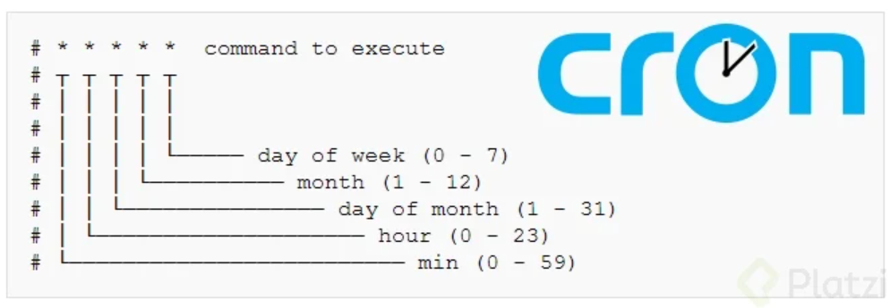

# Procesos en Linux

## 1 - Procesos y demonios en Linux: conceptos y gestión básica

### Proceso Linux

Un proceso es simplemente la representación de un programa que se esta ejecutando en el sistema. Cada vez que abres una aplicación como el navegador, o ejecutas un comando en la terminal, estás creando un proceso. Este proceso utiliza recursos de memoria, entrada y salida del sistema y capacidad de procesamiento.

### Demonio o Daemon

Es un tipo especial de proceso que opera de manera persistente en segundo plano, estos procesos suelen revivir automáticamente bajo ciertas condiciones o tras el inicio del sistema. Ejemplos:

* **Docker:** Para utilizar Docker se necesita un Daemon activo para gestionar los contenedores.
* **Arranque del sistema:** Muchos daemons se inician automáticamente cuando arranca el sistema

### Señales

Son una herramienta para comunicarse con los procesos desde el nivel mas bajo del sistema. Son comandos específicos que se envían para manipular directamente el kernel para realizar tareas como:

* Interrumpir un proceso
* Modificar un proceso
* Copiar un proceso

### Links útiles

[https://www.baeldung.com/linux/process-states](https://www.baeldung.com/linux/process-states)

[https://www-uxsup.csx.cam.ac.uk/courses/moved.Building/signals.pdf](https://www-uxsup.csx.cam.ac.uk/courses/moved.Building/signals.pdf)

## 2 - Gestión de procesos en Linux usando comandos terminales

### ¿Que es un proceso y como puedo verlo?

Un proceso se refiere a un programa u utilidad que es está ejecutando en el sistema operativo. Podemos utilizar varios comandos para listar y examinar estos procesos.

**1. Comando PS:** Muestra los procesos ejecutados en la sesion actual con detalles, como el ID del proceso (PID), terminal asociada, tiempo de ejecución y comando ejecutado.

```
ps
```

**2. Comando ps con banderas:** Para ver todos los procesos en ejecución dentro del sistema.

```
ps aux
```

**3. Uso de GREP para filtrar resultados:** Es una opción especialmente útil para filtrar resultados y buscar procesos específicos asociados a usuarios o programas.

```
ps aux | grep <nombre-usuario>
```
```
ps aux | grep less
```

### Identificar procesos en un puerto específico

Usamos `lsof` para listar los procesos de red vinculados a puertos específicos. 

1. Ejecutar `lsof` en un puerto: Muestra procesos ejecutados en el puerto 22, tipicamente usando por SSH.

```
sudo lsof -i :22
```

### Comando `top`

El comando `top` te permite ver en tiempo real todos los procesos ejecutandose con detalles adicionales como el consumo de CPU y memoria, asi como la prioridad del proceso.

```
top
```

El comando `htop` es una herramienta mejorada de top que viene con mas funcionalidades y una interfaz mas amigable.

```
htop
```

### Control de prioridades en los procesos

Se realiza meidante dos conceptos: **Priority** y **Nice Value**

* Priority: Asignada por el kernel del proceso
* Nice Value: Asignada por el usuario. Valores menores indican mayor prioridad

1. Modificar el nice value con comandos

    * A traves de htop: Usa F7/F8 para subir o bajar la prioridad `sudo htop`

2. Command Nice: Para reestablecer la prioridad antes de ejecutar un comando `nice -n XX command`

### Proceso init

El proceso init es el primer proceso que se inicia en un sistema Linux, de el derivan todos los demas procesos, esta jerarquia se puede visualizar en formato de arbol dentro de `htop`, mostrando como los procesos son clonados del proceso init original.

### Process ID

El Process ID (PID) nos permite:

* La capacidad para iniciar, para o matar procesos.
* Identificar procesos activos y diagnosticar problemas potenciales.

### Links Utiles

[https://www.baeldung.com/linux/process-states](https://www.baeldung.com/linux/process-states)


## 3 - Gestión de procesos en Linux: Estados y Comandos básicos

### Estados de los procesos en Linux

En Linux, cada proceso tiene un estado específico que determina cómo interactúa con el sistema y sus recursos. Dichos estados son:

* **Running o runnable:** Este estado se activa cuando el proceso está utilizando recursos de CPU o memoria.
* **Sleep:** Hay dos tipos de estados de "sleep":
* * **Uninterrumptible sleep (D):** El proceso está esperando que haya suficientes recursos disponibles, no puede ser interrumpido y requiere una señan especíofica, como `SIGKILL` para terminarlo.
* * **Interruptible sleep (S):** Este estado puede ser interrumpido y el proceso se puede finalizar con señales comunes, siempre que esté en espera. 
* **Stopped (T):** El proceso está pausado y no se ejecutará ni al liberar recursos, hasta que se le indique de manera explícita.
* **Zombie (Z):** Un proceso que ha terminado de ejecutarse pero aún tiene una entrada en la tabla de procesos, lo que sucede cuando intenta terminar sin desvincularse del proceso original.

### Comandos básicos para la gestión de procesos

1. Ejecutar un proceso en el background (segundo plano):

```
<comando> &
```

2. Listar procesos en background:

```
jobs -l
```

3. Traer un proceso al foregrpund (primer plano):

```
fg <job-id>
```

4. Pausar y reanudar procesos: Mediante `ctrl + Z` se detiene un proceso y `fg` o `bg` para reanudarlos en foreground o background, repspectivamente.

### Terminar procesos

Para terminar procesos, especialmente aquellos en el background, se puede utilizar el comando `kill` seguido del Process ID (PID). Este comando envia una señal de comando predeterminada (`SIGTERM`):

```
kill 1402
```

En caso de que el proceso no responda, se [puede utilizar una señal mas directa como `SIGKILL` (identificador 9):

```
kill -9 1402
```

### `htop` para la gestion de procesos

Esta herramienta permite:

1. Ver todos los procesos actuales
2. Ordenar y filtrar procesos por ID, uso de CPU, memoria, etc.
3. Terminar procesos seleccionando con `F9` y escogiendo la señal deseada como `SEGTERM` o `SIGKILL`.

### Conmando KillAll

El comando `kkillall` se utiliza para terminar todos los procesos que comparten el mismo nombre. Es especialmente util para cerrar multiples instancias de un programa simultaneamente:

```
killall <nombre-proceso>
```

### Links utiles

[https://www.tecmint.com/linux-process-management/](https://www.tecmint.com/linux-process-management/)

[https://www-uxsup.csx.cam.ac.uk/courses/moved.Building/signals.pdf](https://www-uxsup.csx.cam.ac.uk/courses/moved.Building/signals.pdf)


## 4 - Creacion y gestion de demonios Linux usando SystemD

Estos procesos en segundo plano permiten que nuestro sistema operativo funcione de manera eficiente, ejecutando tareas criticas sin intervencion del usuario.
Dominar la administracion y creacion de demonios te permite automatizar tareas y crear servicios personalizados.

### ¿Que son los demonios y para que sirven?

Los demonios son un mecanismo que tiene Linux para darle un comportamiento de servicio a los procesos. Nosotros podemos configurarlos para que se inicien automaticamente al arrancar el sistema, bajo condiciones especificas y con comportamientos predeterminados.
Estos servicios se crean a traves de archivos llamados "Unit files" que definen como y cuando debe ejecutarse un demonio.
Un caso de común es cuando necesitamos que un script se ejecute constantemente sin intervención manual.

El primer y mas importante demonio en Linux es **SytemD**, que funciona cono el gestor principal de todos los demás demonios del sistema. El mismo es responsable de iniciar componentes críticos como:

* Drivers de red
* Entorno gráfico
* Servicios escenciales del sistema operativo

Para interactuar con **SystemD**, utilizamos **SyswtemCTL** (System Control) que proporciona una interfaz para gestionar los demonios y servicios del sistema.

### Crear un configurar un demonio personalizado
En el siguiente ejemplo vamos a implementar un scriot de Python que funcione como un logger básico, registrando la fecha actual cada segundo en un archivo.

```
import time
from datetime import datetime

while True:
  file = open('/date_logs/timestamp.txt','a')
  file.write(f'Timestamp: {datetime.now()}\n')
  file.close()
  time.sleep(1)
```

#### Confugracion del script

1. Verificar que Python este instalado: `python -V`
2. Crear el directorio donde se guardaran lo logs `mkdir /date_logs`
3. Crear un directorio para nuestros scripts `mkdir /root/scripts`
4. Guardar nuestro script en la ubicacion adecuada `vim /root/scripts/logger.py`

#### Crear el Unit file

El Unit file es la configuracion que nuestro **SystemD** utilizara para gestioar nuestro demonio. Debemos crearlo en la ubicacion correcta:

```
vim /etc/systemd/system/loggerPython.service
```

Y agregar el siguiente contenido:

```
[Unit]
Description = Python Logger
After = muilti-user.target

[Sercice]
Type = simple
Restart = always
ExecStart = /usr/bin/python3 /root/scripts/logger.py

[Install]
WantedBy = multi-user.target
```

Este archivo de configuracion tiene tres secciones principales:

1. [Unit] : Contiene metadatos y dependencias

      * Description: Una descripcion simple del servicio
      * After: Indica que este servicio debe iniciarse despues del target especificado
        
3. [Service] : Define el comportamiento del servicio
   
      * Type: Especifica el tipo de proceso (simple, forking, oneshot,etc)
      * Restart: Dtermina cuando reiniciar el servicio (always, on-failure,etc)
      * ExecStart: El comando que se ejecutara para iniciar el servicio
        
5. [Install] : Configura como se instala el servicio
   
      * WantedBy: Especifica en que target debe incluirse este servicio


#### Activando y gestionando el demonio

Ya creado el Unit file, tenemos que recargar SystemD para que reconozca los cambios:

```
systemctl reload
```

Habilitar el servicio para que se inicie automaticamente al arrancar el sistema:

```
systemctl enable loggerPython.service
```

Para iniciar manualmente el servicio:

```
systemctl start loggerPython.service
```

Para verificar el estado del servicio:

```
systemctl status loggerPython.service
```

Para detener el servicio:

```
systemctl stop loggerPython.service
```

Para deshabilitar el inicio automatico:

```
systemctl disable loggerPython.service
```

### Funcionamiento de los targets

En SystemD, los **targets** son similares a los niveles de ejecucion (runlevels) en sistemas SysV init tradicionales. El target `multi-user.target` que utilizamos en nuestro ejemplo se activa despues de que todos los servicios escenciales (red, drivers,etc.) se han iniciado, permitiendo el acceso a una consola de texto.
Lo targets definen puntos especificos en el proceso de arranque y determinan que sercicios deben estar activos en cada etapa. Esto permite una gestion mas granular y flexible de los servicios del sistema.

### Links utiles

[https://gist.github.com/edevars/22031bf16662aac794795d78ffecf8c8](https://gist.github.com/edevars/22031bf16662aac794795d78ffecf8c8)

[https://gist.github.com/edevars/60ed4509e0ff119358483b7e76e329cf](https://gist.github.com/edevars/60ed4509e0ff119358483b7e76e329cf)

[https://www.digitalocean.com/community/tutorials/understanding-systemd-units-and-unit-files](https://www.digitalocean.com/community/tutorials/understanding-systemd-units-and-unit-files)


## 5 - Configuracion de cronjobs en Linux para tareas automatizadas

### ¿Que es un cronjob y para que sirve?

Es una herramienta que permite automtizar tareas de forma periodica, facilitando la ejecucion programada de scripts y servicios.
Los cronjobs se componen de dos partes: el **crondemon** y el archivo **crontab**.
El crondemon es el servicio que gestiona la ejecucion de las tareas, mientras que el crontab es el archivo donde configuramos cuando y que debemos ejecutar.

### Verificar y configurar un cronjob

Podemos comporbar el estado del crondemon en nuestro sistema utilizando el comando `systemctl status cron` para asegurarnos de que esta en ejecucion.
Luego personalizamos nuestros cronjobs mediante el comando `crontab -e`, el cual nos permite acceder o crear un archivo crontab especifico para nuestro usuario, donde se escriben las reglas de dictan cuando se den ejecutar las tareas.

### Estructura de un cronjob

Cada linea en un archivo crontab corresponde a un solo cronjob, compuesto por 5 campos que especifican el momento de ejecucion:



### Ejemplo de cronjob para actualizar el sistema

Supongamos que queremos programar una tarea de actualizacion de nuestro sistema todos los domingos a las 3:00 am.

```
0 3 * * 0 apt update -y && apt update -y
```

* 0 significa que la tarea se ejecuta al minuto cero
* 3 indica que se ejecutara a las tres de la maniana
* '* *' se utiliza para que el script se ejecute cualquier dia del mes, en cualquier mes
* 0 especifica que se ejecutara todos los domingos

### Gestion de cronjobs para usuarios y sistemas

Cada usuario en el sistema puede tener su propio archivo crontab, lo que permite personalizar las tareas automaticas segun sus necesidades. 

* Los archivos se ubican en `/var/spool/cron/crontabs`
* puedes ver tus jobs con `crontab -l`.
* Para poder editarlos utiliza `crontab -e`.
* Para configurar cronjobs a nivel de sistema (que afecten a todos los usuarios), debes editar el archivo `/etc/crontab`

### Casos de uso y fallas en los cronjobs

El archivo `/etc/crontab` permite tareas que se ejecuten a nivel sin estar ligadas a un usuario especifico, aqui puedes agregar lineas de cronjob que sean necesarias para el mantenimiento general del sistema.

Una limitante de los cronjobs es que no verifican el estado de los scripts que ejecutan. Si un script falla, el cronjob no alerta sobre el problema. Sin embargo, existen herramientas como **Cron Monitor** que ayudan a monitorear estos procesos y generan alertas si algo falla, esto es importante a la hora de trabajar con tareas criticas.

### Links utiles

[https://devhints.io/cron](https://devhints.io/cron)

[https://crontab.guru/examples.html](https://crontab.guru/examples.html)

[https://www.thegeekdiary.com/10-useful-cron-examples-to-schedule-jobs-in-linux/#google_vignette](https://www.thegeekdiary.com/10-useful-cron-examples-to-schedule-jobs-in-linux/#google_vignette)


