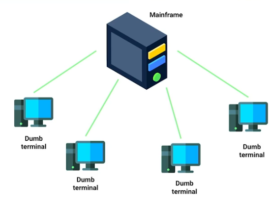
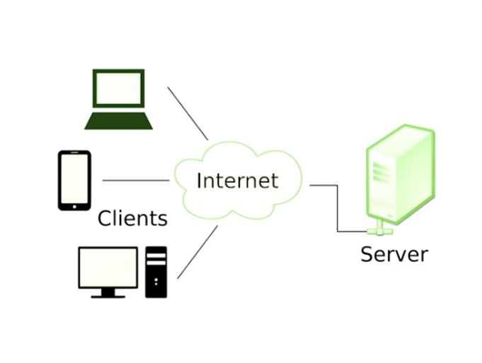
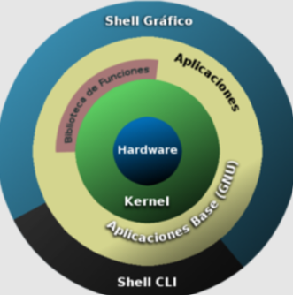
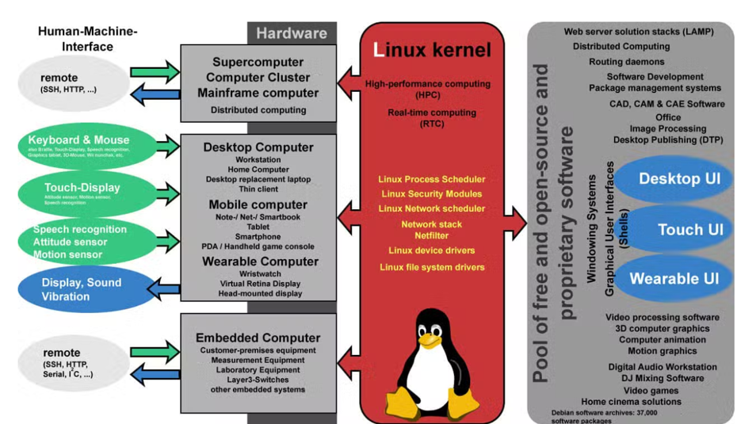
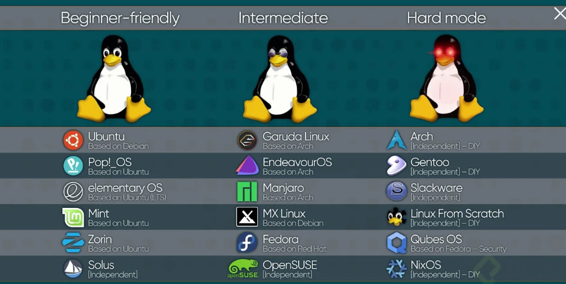
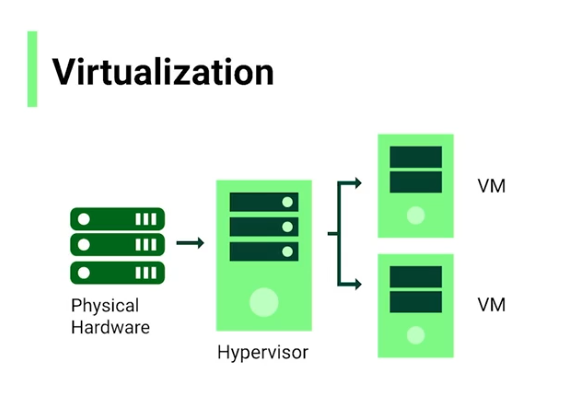

# Introducción a los servidores

## 1 - Administración básica de servidores

### Conocimientos previos

Es recomendable tener conocimientos básicos en Ingeniería de software y el manejo de la terminal, además, es opcional tener conocimientos en lenguajes de scripting como Python o Shell, y una comprensión básica de redes computacionales.

### Objetivos del curso

Familiarización con los servidores Linux: Aprender a identificar los tipos de servidores que incluyen web, de aplicaciones, e-mail y otros.

Comprensión de sistemas Linux: Profundizar en los conceptos clave de servidores y sistemas operativos, abarcando su arquitectura y funcionamiento.

Administración básica de servidores: Montarás y manejarás diferentes tipos de servidores y distribuciones.

Funcionamiento interno de Linux: Procesos de Linux, demonios y otros componentes esenciales para la operatividad del sistema.

## 2 - Habilidades y roles de un administrador Linux

### Habilidades

Es fundamental dominar un conjunto de habilidades clave que trascienden roles específicos y se aplican de manera transversal.

**Control de accesos:** Es fundamental poder otorgar o limitar el acceso a archivos y grupos de recursos según los usuarios y grupos.

**Monitoreo del sistema:** Un administrador debe saber quien está accediendo al sistema, cuando lo está haciendo y que recursos están utilizando a nivel de software y hardware.

**Administración de recursos:** Implica asignar adecuadamente la memoria y el almacenamiento.

**Troubleshooting:** Permite identificar y resolver problemas en el sistema.

**Instalación y mantenimiento de software:** Incluir el aseguramiento de actualización y la gestión de aplicaciones necesarias para el funcionamiento del sistema.

### Roles

Roles
**DevOps Engineer:** Son responsables de la administración de servidores con el propósito de optimizar el desarrollo y el despliegue de software. Esto implica crear servidores de prueba, gestionar el envío de código a producción y seguir las mejores prácticas.

**Site Reability Engineer (SRE):** Se centra en asegurar que los sistemas de software funcionen de manera eficiente y confiable, busca que las aplicaciones y servicios estén siempre disponibles para usuarios y aplicaciones, maximizando la operatividad ininterrumpida.

**Security Operations Engineer:** Se especializan en la seguridad de servidores y la arquitectura de red, son responsables de procesos como el “Hardening”, que previene posibles infiltraciones y ataques.

**Network Engineers:** Garantizan que toda la infraestructura de red esté bien configurada y operativa.

**Database Administrators:** Administran servidores cuyo servicio principal es la base de datos, asegurando sus respaldos y el buen estado de tablas e índices.

**Network Operations Center Engineer:** Actúan en los datacenters brindando soporte tanto a hardware como a software.

**MLOps Engineer:** Se enfocan en sistemas de IA y Machine Learning.

**Cloud Engineers:** Administran servidores y servicios directamente en la nube.

## 3 - Historia y tipos de servidores

### ¿Qué es un servidor?

Un servidor es un conjunto de recursos tecnológicos, tanto en términos de software como de hardware, diseñado para cumplir con uno o varios propósitos específicos. Estos recursos están destinados a responder a las peticiones de los clientes, proporcionando respuestas que cumplen con sus expectativas y necesidades tecnológicas.

### Evolución de los servidores

Originalmente la arquitectura prevaleciente era la “mainframe terminal”. Una computadora central (el mainframe) conectaba múltiples terminales conocidas como DOM terminals, las cuales no poseían ni disco duro ni RAM y dependían completamente del mainframe para cualquier operación.

### Funcionamiento de los servidores modernos

Casos modernos como GeForce de NVIDIA ilustran el poder actual de los servidores. Este servicio permite que los usuarios disfruten de videojuegos sin poseer hardware avanzado en casa. Todo el procesamiento se realiza en servidores remotos y el resultado se transmite al usuario a través de internet. Este servicio es posible gracias a la arquitectura de fibra óptica y la potencia de los datacenters actuales.

### Tipos de servidores

**Servidores web:** Alojan aplicaciones y servicios accesibles desde un navegador.

**Servidores de base de datos:** Almacenan y gestionan información de registros y motores de bases de datos.

**Servidores de pruebas:** Usados por desarrolladores para testear aplicaciones antes de su despliegue en producción.

**Servidores de videojuegos:** Orquestan partidas multijugador y gestionan acciones en tiempo real.

**Servidores de medios:** Almacenan y comparten archivos multimedia como fotos y videos.

**Servidores de correo:** Mueven la comunicación a través de redes privadas internas.

**Servidores de impresión y archivos:** Gestionan colas de impresión y facilitan el intercambio de archivos.

**Servidores VoIP:** Permiten realizar llamadas telefónicas a través de internet.

## 4 - Introducción a los sistemas operativos Linux

### ¿Qué es un sistema operativo Linux?

A menudo se refiere a un “kernel” que es el núcleo de cualquier sistema operativo, el cual funciona como un intermediario, conectando el hardware con el software y permitiendo que todos los componentes de un sistema operativo funcionen en memoria. Pero cuando se habla de sistemas operativos Linux, generalmente nos referimos a GNU/Linux.

### ¿Qué es GNU/Linux?

Es una familia de sistemas operativos que utilizan el kernel de Linux y se complementan con el software del proyecto GNU. Este proyecto iniciado en los años 80 se centra en proporcionar un sistema operativo de software libre. Es conocido por su flexibilidad y capacidad de adaptación, lo que ha dado lugar a una amplia variedad de distribuciones.

Algunas de las principales distribuciones de Linux son:

**Red Hat Enterprise Linux (RHEL):** Conocido por su estabilidad y soporte, es ampliamente utilizado en entornos empresariales.
**Ubuntu:** Basado en Debian, es conocido por su facilidad de uso y cuenta con una enorme comunidad de usuarios.
**Debian:** Reconocido por su estabilidad y gran cantidad de paquetes de software disponibles.

### Diferencias entre sistemas Linux y Unix

Linux utiliza el kernel de Linux en sus sistemas operativos, en cambio, Unix es un sistema operativo desarrollado en 1969 por los laboratorios Bell de AT&T.
MacOS es una de las principales plataformas que incorporan elementos de Unix, en realidad MacOS integra atributos de Unix en su arquitectura.

### Ventajas y desventajas de las distribuciones Linux

La elección de una distribución de Linux depende de las necesidades específicas de usuario o de la organización.

**Costo:** Las distribuciones como Debian y Ubuntu son gratuitas, lo que las hace atractivas para startups y pequeñas empresas.

**Soporte y actualización:** Distribuciones como RHEL ofrecen soporte técnico detallado y actualizaciones regularizadas, ideadas para entornos corporativos.

**Facilidad de uso:** Ubuntu es popular entre principiantes debido a su interfaz amigable.

### Lectura complementaria

[https://www.fosslinux.com/44623/top-unix-based-operating-systems.htm](https://www.fosslinux.com/44623/top-unix-based-operating-systems.htm)

[https://www.kernel.org/category/about.html](https://www.kernel.org/category/about.html)

[https://www.digitalocean.com/community/tutorials/a-comparative-introduction-to-freebsd-for-linux-users](https://www.digitalocean.com/community/tutorials/a-comparative-introduction-to-freebsd-for-linux-users)

## 5 - Arquitectura de sistemas UNIX/Linux: capas y funciones

Estos sistemas operativos están basados en una arquitectura de capas, donde cada una desempeña un rol específico en el funcionamiento del sistema, este modelo no solo ayuda a estructurar las tareas internas, sino que además facilita la interacción entre el hardware y el software.

### Capa de hardware

Constituye el núcleo de un sistema Linux, siendo la base sobre la cual se constituyen las demás capas, engloba a los dispositivos físicos conectados a la computadora como: discos duros, mouses, memoria RAM, procesadores y tarjetas de red. El hardware es el fundamento que permite la ejecución de cualquier operación en el sistema y define las capacidades físicas de la máquina.

### Capa del kernel en Linux

El kernel es el núcleo del sistema operativo Linux, que tiene la función de:

* Gestionar la interacción del hardware con los niveles superiores.
* Controlar la memoria RAM y los ciclos del CPU.
* Pasar información a las capas superiores, permitiendo un flujo de información eficiente.

### Capa del Shell

Funciona como la interfaz entre el kernel y las aplicaciones, permite al usuario enviar comandos al núcleo del sistema para que sean procesados y ejecutados. Es esencial ya que, sin ella, el usuario no tendría forma directa de comunicarse con el sistema para realizar tareas o ejecutar aplicaciones.

Sus funciones incluyen:

* La ejecución de comandos en la terminal
* Es la interfaz que traduce y transmite las solicitudes del usuario al kernel.

### Capa de aplicaciones

También conocida como la capa de utilidades, es el nivel mas cercano al usuario, donde se alojan aplicaciones y herramientas que usamos diariamente, tales como calculadoras, calendarios, navegadores, comandos para manipulación de archivos.

La administración de esta capa es crucial ya que aquí se instala y ejecuta el software que define la experiencia de usuario y la funcionalidad del sistema.

## 6 - Historia del software libre y Open Source

Comienza en la década de 1980 con un incidente inesperado que desencadena un movimiento global, es aquí donde entra en juego Richard Stallman, un ingeniero del MIT cuya experiencia con una impresora Xerox cambiaría el rumbo del desarrollo de software.

Richard Stallman enfrentó un problema común con impresoras: la incapacidad de manejar múltiples solicitudes de impresión al mismo tiempo. Había resuelto este problema previamente con impresoras de otros fabricantes creando un software capaz de encodar de manera concurrente, pero su impresora Xerox venía con software precompilado sin acceso al código fuente.

Esto lo inspiró a crear en 1983 el sistema operativo GNU, que promovía la accesibilidad y modificación del código fuente por cualquier persona. En 1985 fundó la Free Software Foundation, una organización que define y defiende las cuatro libertades esenciales del software libre:

1.	**Ejecutar el programa:** Libertad para cualquier usuario de acceder y ejecutar el software,
2.	**Estudiar y modificar:** Acceso al código fuente para su estudio y modificación acorde las necesidades individuales.
3.	**Redistribuir:** Capacidad de compartir copias del software modificado
4.	**Distribuir versiones modificadas:** Posibilidad de compartir copias de sus versiones modificadas, permitiendo una mayor colaboración comunitaria.

### Linux y el software libre

En 1990, Linus Torvalds compartió un post anunciando su proyecto de un kernel similar a UNIX, como un hobby. Para 1993 Linux se consolidó como software libre, transformándose en el corazón de numerosos sistemas operativos. En conjunto, GNU y Linux fomentaron un ecosistema donde el software se desarrollaba de manera abierta y colaborativa.

### Diferencias entre Open Source y Software Libre

El software libre se centra en las libertades éticas y filosóficas, mientras tanto, el open source adopta un enfoque pragmático incentivando la mejora del software a través de la colaboración abierta pero con ciertas limitaciones. Mientras que el software libre asegura las cuatro libertades propuestas por la Free Software Foundation, el open source permite acceso al código para que los usuarios lo mejoren sin garantizar la redistribución o comercialización. Esto permite que las empresas compartan código sin comprometer completamente su propiedad intelectual.
Ejemplos de softwares Open Source destacados en la industria son Blender, OBS y React.js

## 7 - Distribuciones Linux y UNIX: Comparación y características

### Distribuciones de un sistema operativo

Se refiere a una versión especifica de un sistema que utiliza el kernel de Linux o UNIX. Estas distribuciones varían principalmente en tres aspectos: el formato de discos utilizados al crear el sistema, el manejador de paquetes que facilita la instalación y desinstalación del software, y su popularidad en la comunidad.

### Distribuciones más populares

* **Ubuntu Server:** Una de las distribuciones de servidores mas conocidas y populares, derivada de Debian. Ambas comparten arquitectura y un sistemas manejador de paquetes similar aunque presentan diferencias en las políticas sobre qué software instalar.
* **Red Hat Enterprise Linux (RHEL):** Conocida simplemente como “Red”, es una distribución de pago que ofrece soporte extenso a empresas. Se destaca por su seguridad y fiabilidad, estando dedicada principalmente a uso empresarial.
* **FreeBSD:** Es una distribución basada en UNIX, no en Linux. Se utiliza principalmente en servidores y su núcleo se basa en el antiguo sistema operativo UNIX.

### Soporte a largo plazo (LTS)

Long term Support se refiere a distribuciones que ofrecen soporte extendido, garantizando alrededor de 5 años de actualizaciones y mantenimiento. Ejemplo: versiones especificas de Ubuntu y Debian.

### Non-free Repository

En distribuciones basadas en Debian, los non-free repositories son paquetes de software cuya licencia no ha sido aprobada por los lineamientos de la Debian Free Software Foundation, implica que no garantizan las libertades del software libre. Es fundamental para instalar software especializado como drivers de NVIDIA. En resumen, son paquetes con licencias externas a las aceptadas por Debian.

### Actualización de distribucionesu

* **Rolling in release:** Estas distribuciones incorporan cambios de software tan pronto como están disponibles, lo que puede resultar en versiones inestables con bugs. Ejemplo son Fedora Server y CentOS Stream.
* **Fixed Release:** Estas distribuciones tienden a ser mas estables, liberando actualizaciones solo después de pruebas exhaustivas. Ejemplo: Red Hat Enterprise Linux.

## 8 - Ubicación y gestión de servidores: On-premise, Cloud e Hibrido

En el mundo actual, donde la tecnología y la nube dominan, hay varios entornos donde pueden alojarse tus servidores, estos incluyen el ecosistema “on-premise”, las nubes publicas y privadas, y configuraciones hibridas.

### On-premise

Un entorno “on-premise” (en las instalaciones) implica que todo el hardware y software del servidor es alojado y mantenido por una organización. Esto significa que se cuenta con sistemas administradores que se encargan desde conectar dispositivos hasta configurar servicios. Generalmente este entorno es preferido por compañías tradicionales o instituciones gubernamentales que requieren un control total y directo de sus servidores, principalmente por razones de seguridad. Ventajas:

* Control total sobre el hardware y software.
* Adecuado para organizaciones que requieren alta seguridad y privacidad.
* No depende de servicios externos.

### Cloud

Es básicamente el uso de la infraestructura y arquitectura que ya ofrece otra empresa. Los administradores no necesitan preocuparse por los aspectos físicos del hardware. Existen dos tipos de nubes.

### Nube pública

Las nubes públicas son ofrecidas por proveedores como Google Cloud Platform, Azure y Amazon, estos servicios permiten a las organizaciones acceder a recursos de hardware y software sin necesidad de comprarlos ni mantenerlos. Ventajas:

* No es necesario invertir en infraestructura física
* Escalabilidad y flexibilidad de recursos
* Menor costo inicial y mantenimiento

### Nube privada

Es un entorno en el que todos los recursos están dedicados exclusivamente a una organización, esto ofrece un nivel de seguridad y privacidad superior, ya que los recursos no se comparten con ninguna otra entidad. Ventajas:

* Recursos dedicados exclusivamente.
* Mayor control y seguridad.
* Personalización según necesidades específicas de la organización.

### Hibrido

El entorno hibrido combina las características del on-premise y la nube. Algunas organizaciones optan por mantener parte de su infraestructura en sus instalaciones mientras que otras utilizan servicios en la nube para el almacenamiento o procesamiento adicional. Ventajas:

* Flexibilidad para utilizar lo mejor de ambos mundos.
* Permite optimizar costos y recursos.
* Adecuado para organizaciones que experimentan variaciones en sus necesidades de recursos

### ¿Qué es un DataCenter?

La gran mayoría de los servidores modernos están alojados en grandes instalaciones llamadas DataCenters. Estos centros están equipados con todos los recursos necesarios y personal altamente capacitado para gestionar la infraestructura y servicios. Beneficios de los DataCenters:

* Alta eficiencia en la gestión y operación de servidores.
* Mejora de la capacidad de enfriamiento.
* Centralización y estandarización de servicios.

## 9 - Instalación de servidores Linux y virtualización básica

### Instalación directa

Es instalar un sistema operativo directamente sobre el hardware físico. Lo fundamental es que este método utiliza el 100% de los recursos asignados, como memoria RAM y potencia de procesador para un máximo rendimiento. Esto puede hacerse mediante el uso de:

* **Imágenes ISO:** Archivos que contienen la copia de un sistema operativo completo.
* **UBS boteable:** Dispositivos USB configurados para ejecutar e instalar sistemas operativos al conectarse al hardware.
* **Descargas de red:** Permiten la instalación de sistemas operativos directamente desde servidores de red.

### Virtualización en los Data Centers

En las instalaciones que contienen grandes cantidades de hardware, organizados en estructuras llamadas racks, la virtualización se vuelve esencial para maximizar el uso de este hardware mediante el uso de hypervisor.

### Hypervisor

Es un software que permite dividir los recursos de una maquina física en múltiples maquinas virtuales. Esto es ideal para crear entornos de prueba o correr diferentes sistemas operativos sin necesidad de hardware adicional.

* **Hypervisors tipo 1 (bare metal):** Corren directamente sobre el hardware, sin necesitar un sistema operativo entre el hardware y el hypervisor. Son eficientes en el uso de recursos y típicamente utilizados en entornos empresariales.
* **Hypervisors tipo 2:** Se instalan sobre un sistema operativo existente, como Linux, Windows o Mac. Son más accesibles y comúnmente usados para propósitos educativos y de pruebas.

### Diferencias entre contenedores y máquinas virtuales

* **Maquinas virtuales (VMs):** Tienen asignación de recursos físicos directamente, permitiendo gran personalización y aislamiento del entorno.
* **Contenedores:** Comparten muchos recursos del sistema operativo anfitrión, son mas ligeros y rápidos, ideales para ejecutar aplicaciones en ambientes de microservicios y tecnología Docker.

